# ARCHITECTURE AUDIT — CATALYST CONTENT OS
## Autonomous Campaign-Driven Documentary Content Production Studio

> **Authoritative System Audit Document**  
> **Repository:** `Ritish017/Remotion`  
> **State:** Post-Phase 7 Generic Production Engine  
> **Target:** Autonomous Campaign-Driven 30-Day Documentary Studio  
> **Date:** August 2026

---

## 1. Executive System Overview & Mission

Catalyst Content OS is transitioning from a standalone video rendering engine to an **Autonomous Campaign-Driven Documentary Content Production Studio**.

### Fundamental Core Philosophy:
$$\text{STORY FIRST} \longrightarrow \text{VISUAL MEANING SECOND} \longrightarrow \text{MOTION THIRD} \longrightarrow \text{POLISH FOURTH}$$

The platform is designed to produce comprehensive monthly editorial campaigns (e.g., *Daily AI News*, *AI Learning Series*, *Future Technology*, *Finance Explained*, *Robotics*, *Science Explained*, *Startup Intelligence*). Every episode in a 30-day calendar must receive its own distinct **Episode DNA** and achieve a **Visual Novelty Score $\ge 75$** against historical memory to ensure that every video feels like a bespoke, professionally art-directed production rather than a recycled template.

---

## 2. End-to-End System Call Graph & Runtime Architecture

```mermaid
flowchart TD
    subgraph CampaignEngine["1. Campaign & Calendar Orchestration"]
        CampEntity["Campaign Entity\n(Brand, Pillars, Tone, Visual/Editorial Identity, Memory)"]
        CampDir["CampaignDirector Agent (Claude Opus)\nMonthly Strategy & 30-Day Topic Matrix"]
        CalUI["30-Day Content Calendar UI (/campaigns)\nStatus Grid: DRAFT -> RESEARCHING -> SCRIPT_READY -> DESIGNING -> PREVIEW -> RENDERING -> COMPLETED"]
        Memory["Campaign Memory & Visual Style Memory\nTracks previous styles, metaphors, hooks, camera curves"]
    end

    subgraph EpisodeDirector["2. Autonomous Episode Director Pipeline"]
        TopicSel["Selected Date / Topic"]
        Research["ResearchOrchestrator\n(Firecrawl / Apify / Web / Factual Claims)"]
        Content["ContentDirector\n(7 Narrative Beats + Cadence + Verified Sources)"]
        AudioEng["OpenAIAudioProvider\n(TTS-1 Onyx + Whisper-1 Forced Alignment)"]
        StoryFirst["Story-First Visual Mapper\n(Narration -> Meaning -> Emotion -> Metaphor -> Composition)"]
        DnaEng["Episode DNA Engine\n(15 Dimensions: Palette, Typography, Motion, Texture, Camera)"]
        NoveltyGate{"Visual Novelty Gate\nScore >= 75?"}
        Redesign["Visual Redesign Loop\n(Recalibrate Visual Language)"]
        VisualDir["VisualDirector\n(Spatial 7-Layer Planning + Micro-Beats)"]
        AssetDir["AssetDirector & Cache\n(Topic-Specific Imagery & Clean Vector SVGs)"]
        MotionDir["MotionDirector\n(24+ Semantic Motion Primitives & Temporal Phases)"]
        ProdAgent["ProductionAgent\n(Assembles Authoritative VideoSpec v2.1.0)"]
    end

    subgraph StudioPreview["3. Live Preview & Claude Iteration Workspace"]
        StudioUI["Remotion Production Studio (/studio & /campaigns/...)\nLive In-Browser Remotion Player + Timeline"]
        ClaudeIter["Claude Live Iteration Drawer\nNatural Language Scene Modifications"]
        SpecAPI["POST /api/remotion/spec\nZero-Render Realtime Timeline Updates"]
    end

    subgraph VisualCriticLoop["4. Multimodal Quality Gate & Auto-Repair"]
        FrameEx["FrameExtractor / FFmpeg\nExtracts Keyframes (0% to 100%)"]
        Critic["VisualCriticAgent (Claude Vision)\nComposition, Hierarchy, Anti-Dashboard, Contrast >= 8.5/10"]
        AutoRepair{"Passed Quality Gate?"}
        Correction["Correction Patch Application\n(Scale, Camera Intensity, Occupancy Pct)"]
    end

    subgraph LocalRendering["5. Local-First Headless Render Engine"]
        Bundler["@remotion/bundler\nBundles src/remotion/index.ts"]
        Renderer["@remotion/renderer (renderMedia)\nLocal Headless Chromium H.264 / CRF 18-22"]
        Comp["MasterComposition.tsx\n7-Layer Depth Stack + Karaoke Pill Captions"]
        DiskStore["LocalStorageProvider\n./storage/renders/<jobId>/output.mp4"]
        SQLiteStore["SQLiteDatabaseProvider (node:sqlite)\n./storage/catalyst.db"]
    end

    CampEntity --> CampDir
    CampDir --> CalUI
    CalUI --> Memory
    CalUI --> TopicSel
    TopicSel --> Research
    Research --> Content
    Content --> AudioEng
    AudioEng --> StoryFirst
    StoryFirst --> DnaEng
    DnaEng --> NoveltyGate
    NoveltyGate -- "<75" --> Redesign
    Redesign --> DnaEng
    NoveltyGate -- ">=75" --> VisualDir
    VisualDir --> AssetDir
    VisualDir --> MotionDir
    AssetDir --> ProdAgent
    MotionDir --> ProdAgent
    AudioEng --> ProdAgent
    ProdAgent --> StudioUI
    StudioUI <--> ClaudeIter
    ClaudeIter <--> SpecAPI
    StudioUI --> Bundler
    Bundler --> Comp
    Comp --> Renderer
    Renderer --> DiskStore
    Renderer --> SQLiteStore
    DiskStore --> FrameEx
    FrameEx --> Critic
    Critic --> AutoRepair
    AutoRepair -- "Fail" --> Correction
    Correction --> ProdAgent
    AutoRepair -- "Pass (>=8.5/10)" --> CalUI
```

---

## 3. Comprehensive 10-Point Subsystem Audit

### Point 1: Repository Structure & Active vs Archived Paths
- **Active Core Paths**:
  - `src/lib/ai/claude/`: Primary AI orchestration and Director agents.
  - `src/lib/video-spec/`: VideoSpec schemas, validation, visual systems, and presets.
  - `src/remotion/`: Compositions, scenes, visual language registries, and 2.5D layer stacks.
  - `src/lib/database/`: `SQLiteDatabaseProvider.ts` (Node 22 `DatabaseSync`), the single source of truth for local persistence.
  - `src/lib/rendering/`: Local headless Chromium renderer (`local.ts`) and keyframe extractor (`frameExtractor.ts`).
  - `src/components/remotion/`: In-browser live studio with Remotion Player, proportional scrubber, and scene inspectors.
- **Archived / Disconnected Paths (To Clean Up & Bypassed)**:
  - `src/lib/supabase.ts`: Fallback mock client (`placeholder.supabase.co`).
  - `src/lib/video-generation.ts`: Legacy AWS Nova Reel video prompts from early prototypes.
  - `src/app/api/catalyst/`: Legacy preview/download routes from cloud scaffolding.

### Point 2: Architecture Call Graph & Layer Separation
The codebase cleanly separates:
1. **AI Director Layer** (`src/lib/ai/claude/agents/`): Transforms narrative concepts into typed data structures.
2. **Schema & Contract Layer** (`src/lib/video-spec/`): Enforces structural integrity via Zod schemas.
3. **Presentation & Motion Layer** (`src/remotion/`): Pure deterministic React components animated over frames.
4. **Persistence Layer** (`src/lib/database/`): SQLite schema with foreign key isolation.
5. **Execution Layer** (`src/lib/rendering/`): Bundling, headless Chrome rendering, and FFmpeg frame extraction.

### Point 3: Identification of Reusable Components
- **`RemotionProductionStudio`**: Complete real-time studio with player viewport, timeline scrubber, scene inspector, and Claude drawer.
- **`VisualLanguageRegistry`**: Modular registry pattern supporting 20+ documentary visual languages.
- **`LayerStack`**: 7-plane 2.5D parallax compositor with spring-based motion curves.
- **`CameraRig`**: Spring and keyframed camera transforms (push, pull, pan, orbit, parallax).
- **`SQLiteDatabaseProvider`**: Synchronous, robust local database engine.
- **`OpenAIAudioProvider`**: TTS-1 speech synthesis + Whisper word forced alignment.
- **`VisualCriticAgent`**: Claude Vision keyframe critique engine.
- **`AutomatedQA`**: 12-suite validation gate for frame rhythm, caption timing, and visual density.

### Point 4: Identification of Duplicate or Fragmented Systems
- **Campaign Data Fetching**: `src/hooks/useCampaign.ts` and `src/hooks/useEpisode.ts` were attempting to query Supabase instead of the local SQLite database.
- **Campaign Planning API**: `src/app/api/campaigns/plan/route.ts` used a basic prompt without episode DNA, visual style diversity, or campaign memory.

### Point 5: Phase 6 & Phase 7 Visual Systems
- **Phase 6 (Vox Editorial Engine)**:
  - `src/lib/video-spec/visualSystem.ts`: `LockedVisualSystem`, `DocumentaryPalette`, halftone dots, paper textures, and red marker editorial marks.
  - `src/remotion/visuals/EditorialCollage.tsx`, `EditorialMarks.tsx`.
- **Phase 7 (Generic Multi-Topic Documentary Engine)**:
  - `src/lib/ai/claude/agents/VisualDirector.ts`: Decomposes scenes into 2–4 micro `VisualBeat` units.
  - `src/remotion/composition/VisualBeatRenderer.tsx`: Micro-beat sequencing with match-cut transitions.
  - `src/remotion/visuals/primitives/`: 3D Perspective Die, Skewed Monolith Towers, Corridor Flight Arcs, Laser Scan Bars.

### Point 6: Current VideoSpec Capabilities & Gaps
- **Current VideoSpec Capabilities**:
  - Contains `id`, `title`, `composition` (format, fps, duration), `brand` (`BrandDNA`), `narration` (words, transcript, audioUrl), `scenes` (`SceneData[]` with `visualBeats`, `camera`, `typography`, `layers`, `assets`), `audio` (music, sfx, ducking), `research_sources`, `research_facts`, `claims`.
- **Gaps for Autonomous Campaign Studio**:
  - Missing formal `episodeDNA` field on top-level VideoSpec.
  - Missing `temporalPhase` mappings (`ENTRY`, `BUILD`, `EMPHASIS`, `TRANSFORMATION`, `EXIT`) per scene.
  - Missing explicit Story-First mapping data (`narrativePurpose`, `emotionalIntent`, `visualMetaphor`, `visualProtagonist`).

### Point 7: Current SQLite Entities & Required Additions
- **Current Tables in `catalyst.db`**:
  - `render_jobs`, `narration_artifacts`, `projects`, `channels`, `episodes`, `video_specs`, `research_sources`, `research_facts`, `provider_usage`.
- **Required New / Enhanced Tables**:
  - `campaigns`: Full campaign identity (name, niche, target audience, platforms, pillars, tone, visual identity, duration, aspect ratio, narration style, CTA strategy, monthly strategy).
  - `episode_dna`: 15-attribute DNA structure linked to each episode and spec.
  - `campaign_memory`: Topics covered, visual styles used, visual styles to avoid, hook performance, episode history.
  - `visual_style_memory`: Historical log of compositions, motion primitives, cameras, and palettes for novelty scoring.

### Point 8: Headless Local Render Pipeline
- **Bundling**: `@remotion/bundler` bundles `src/remotion/index.ts` to temporary disk cache.
- **Audio Delivery**: Converts local MP3/WAV files into `data:audio/wav;base64,...` URIs to eliminate Puppeteer HTTP deadlocks.
- **Render Execution**: `@remotion/renderer` renders `MasterComposition` (1080x1920 @ 30fps) with H.264 codec.
- **Post-Processing**: FFmpeg extracts 21 review keyframes across the timeline for Claude Vision evaluation.

### Point 9: In-Browser Live Preview System
- **Remotion Player**: Zero-latency React canvas preview in `LivePlayerViewport.tsx`.
- **Proportional Timeline**: Visual scrubber showing scene blocks, word-level caption triggers, and audio waveforms.
- **Live Claude Iteration**: Claude modifies the JSON VideoSpec and immediately updates the React Player state without MP4 rendering.

### Point 10: Claude Agent Network & Model Routing
- **`ModelRouter` (`src/lib/ai/claude/modelRouter.ts`)**:
  - Routes creative art direction, story architecture, and visual critique to `CLAUDE_PRIMARY_MODEL` (default: `claude-opus-5`) with max thinking tokens.
  - Routes structured formatting, metadata, and asset queries to `CLAUDE_FAST_MODEL` (default: `claude-sonnet-5`).
  - Environment-configurable routing without hardcoded model strings.

---

## 4. Verification & Hardening Baseline

Current baseline checks confirmed operational:
- **`npm test`**: 12/12 test suites passing (Zod schema validation, template registry, automated QA, narration timeline, SQLite CRUD, storage security).
- **`npx tsc --noEmit`**: 0 compilation errors across the entire TypeScript codebase.

---

## 5. Architectural Readiness Scorecard

| Architectural Domain | Current Status | Readiness for Campaign Engine |
|---|---|---|
| **Remotion Rendering Engine** | Broadcast Grade (1080x1920 @ 30fps) | 100% Ready |
| **Local SQLite Persistence** | Operational (`catalyst.db`) | 90% Ready (Need Campaign/DNA tables) |
| **AI Director Agent Network** | 9 Specialized Claude Agents | 85% Ready (Need CampaignDirector & DNA Engine) |
| **Live In-Browser Studio** | Player + Scrubber + Claude Drawer | 95% Ready |
| **Multimodal Vision Critic** | 21-Frame Claude Vision Inspector | 90% Ready (Need closed Auto-Repair loop) |
| **Campaign & Calendar UI** | Basic grid & listing | 60% Ready (Need 30-day strategy & status machine) |
| **Anti-Generic Style Memory** | Not yet formalized | 0% Ready (Target implementation) |
