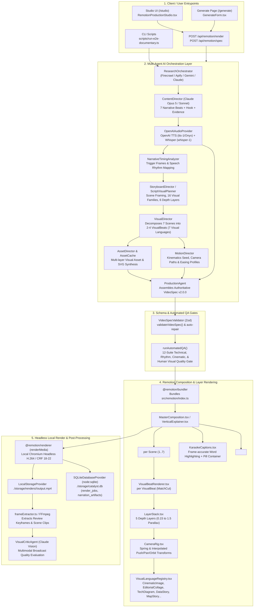

# CATALYST CONTENT OS — SYSTEM EXECUTION & CALL GRAPH MAP

> **Authoritative System Reconnaissance Document**  
> **Repository:** `Ritish017/Remotion`  
> **Timestamp:** August 2026 / Local Production Architecture Verification  
> **Mode:** Local-First Full-Stack Remotion AI Video Production Engine

---

## 1. Executive System Overview

Catalyst Content OS is an autonomous, AI-orchestrated documentary and short-form video generation platform. Built on **Next.js 16 (App Router)**, **React 19**, **Remotion 4.0**, and **Node.js 22**, it converts raw topics, breaking news, or domain briefs into broadcast-grade MP4 video files with forced-aligned captions, multi-layer 2.5D visual motion graphics, and synchronized narration.

### Core Architectural Shift Discovered in Codebase
The repository contains **two distinct generation paradigms**:
1. **Legacy Cloud Scaffolding (Pre-Migration / Archived):** AWS Bedrock (Amazon Nova Reel text-to-video / image-to-video async invocations stored in S3 and tracked via Supabase PostgreSQL table `live_event_states`).
2. **Current Local Production Engine (Active / Primary):** A local-first documentary engine where multi-agent Claude directors plan a 7-scene narrative, OpenAI synthesizes voiceover and Whisper word timestamps, Remotion executes frame-accurate React animations locally via `@remotion/renderer` (Puppeteer/Headless Chrome), and jobs/specs are persisted to SQLite (`./storage/catalyst.db`).

---

## 2. End-to-End Call Graph & Runtime Flow

---

## 3. Detailed Step-by-Step Execution Trace

### Phase 1: Research & Evidence Synthesis
- **Entry:** `ResearchOrchestrator.conductResearch({ topic, useStructuredData, targetDurationSeconds })` (`src/lib/research/ResearchOrchestrator.ts`).
- **Data Ingestion:**
  - Firecrawl (`FirecrawlProvider.ts`): Scrapes 3 verified web sources.
  - Apify (`ApifyProvider.ts`): Fallback structured Google search datasets.
  - YouTube Data API (`src/lib/research.ts`): Competitor metadata and search trends.
- **Synthesis:** Claude analyzes extracted markdown and returns `ResearchReport` containing `executiveSummary`, `facts` (with confidence scores), `keyMetrics`, and `timelineEvents`.

### Phase 2: Narrative Scripting & Content Direction
- **Entry:** `runContentDirector(params)` (`src/lib/ai/claude/agents/ContentDirector.ts`).
- **Prompt:** `CONTENT_DIRECTOR_SYSTEM_PROMPT` enforces a 7-beat documentary arc:
  1. Hook (0–5s): Counter-intuitive disruption.
  2. Context (5–12s): The status quo.
  3. Escalation / Data Surge (12–20s): Quantified pivot.
  4. Core Mechanism (20–32s): Technical deep dive.
  5. Planetary Scale / Corridors (32–38s): Geopolitics/macro.
  6. Payoff (38–43s): Critical realization.
  7. Outro (43–45s): Punchline & brand signature.
- **Output:** `ContentDirectorOutput` containing `title`, `hook`, `narrativeStructure`, `fullTranscript`, and citation records.

### Phase 3: Audio Generation & Word-Level Timestamp Alignment
- **Entry:** `generateNarration(transcript)` (`src/lib/audio/narrator.ts`).
- **Speech Synthesis:** Calls `OpenAIAudioProvider.synthesize(text, { voice: 'onyx', model: 'tts-1' })`.
- **Forced Alignment:** Calls `OpenAIAudioProvider.alignWords(audioBuffer, transcript, { model: 'whisper-1' })` with `timestamp_granularities[]=['word']`.
- **Storage:** Writes audio file to `./storage/audio/<id>.mp3` and inserts metadata into SQLite `narration_artifacts`.
- **Timing Analysis:** `analyzeNarrativeTiming()` (`src/lib/ai/claude/agents/NarrativeTimingAnalyzer.ts`) scans word array and marks visual trigger frames.

### Phase 4: Script-to-Timeline & Visual Scene Decomposition
- **Entry:** `runStoryboardDirector()` or `scriptVisualPlanner.planTimeline()` (`src/lib/ai/claude/agents/StoryboardDirector.ts`, `ScriptVisualPlanner.ts`).
- **Visual Micro-Beats:** `runVisualDirector()` (`src/lib/ai/claude/agents/VisualDirector.ts`) splits each 6–8 second scene into 2–4 `VisualBeat` micro-units (duration 1.5–3.5s).
- **Visual Languages Assigned:**
  - `cinematic-photo` (Macro optics / depth blur)
  - `editorial-paper` (Archival paper texture / stamp overlay)
  - `data-story` (Monolithic bar/line growth curves)
  - `geographic-story` (Planetary node trade corridors)
  - `technical-diagram` (Isometric exploded schematic grids)
  - `cinematic-statistic` (Giant kinetic metric monoliths)
  - `cinematic-outro` (Brand badge payoff)

### Phase 5: Asset Resolution & Kinematic Motion Mapping
- **Entry:** `runAssetDirector()` & `runMotionDirector()` (`src/lib/ai/claude/agents/AssetDirector.ts`, `MotionDirector.ts`).
- **Asset Resolution:** Queries `AssetCache.ts` (`src/lib/storage/AssetCache.ts`) which resolves image URLs from `ASSET_REGISTRY` (`src/lib/assets/registry.ts`) or synthesizes vector SVGs on disk.
- **Motion Generation:** Generates deterministic camera movement paths (`push`, `pull`, `pan-left`, `pan-right`, `orbit`, `parallax`) with spring dampening and focal coordinates.

### Phase 6: VideoSpec v2.0 Assembly & Automated QA Gate
- **Entry:** `assembleVideoSpecV2()` (`src/lib/ai/claude/agents/ProductionAgent.ts`).
- **Schema Validation:** `validateVideoSpec()` (`src/lib/video-spec/validator.ts`) enforces strict Zod schema compliance (`src/lib/video-spec/schema.ts`). Frame start/end offsets are normalized.
- **Automated QA:** `runAutomatedQA()` (`src/lib/qa/index.ts`) evaluates 12 technical and visual suites:
  - Human Visual Quality Gate (Composition, Density, Typography >= 8.0/10)
  - Word-level caption monotonically increasing sequence
  - Safe-zone margins & contrast
  - Camera bounding & parallax depth bounds
  - Visual rhythm & scene transition smoothness

### Phase 7: Local Remotion Rendering Engine
- **Entry:** `createLocalRenderJob({ spec })` (`src/lib/rendering/local.ts`).
- **Bundle Generation:** Bundles `src/remotion/index.ts` via `@remotion/bundler` to temporary directory.
- **Audio Embedding:** Automatically converts local audio files into base64 `data:audio/wav;base64,...` data URIs to guarantee zero-latency Puppeteer browser playback without HTTP deadlock.
- **Headless Execution:** Invokes `@remotion/renderer` `renderMedia()` using Chromium:
  - Composition: `MasterComposition` or `VerticalExplainer`
  - Dimensions: 1080×1920 (9:16) @ 30 FPS
  - Codec: H.264, CRF 18–22, AAC Audio
- **Output:** Stored at `./storage/renders/<jobId>/output.mp4`.
- **Database Status:** Inserts `COMPLETED` record into SQLite `render_jobs` table.

### Phase 8: Keyframe Extraction & Multimodal Vision Critique
- **Entry:** `frameExtractor.ts` (`src/lib/rendering/frameExtractor.ts`).
- **Extraction:** Generates 11 keyframe PNGs at [0%, 10%, 20%, ..., 100%] along with scene clips via FFmpeg.
- **Vision QA:** `visualCriticAgent.critiqueFrames()` (`src/lib/ai/claude/agents/VisualCriticAgent.ts`) passes extracted PNGs to Claude Vision, scoring composition, typography, and contrast.

---

## 4. File-by-File Critical Path Mapping

| Subsystem | Critical Source Files | Primary Responsibility |
|---|---|---|
| **AI Orchestration** | `src/lib/ai/claude/runtime.ts` `src/lib/ai/claude/agents/*.ts` | Multi-agent pipeline coordinating content, storyboards, timing, and assets. |
| **Audio Engine** | `src/lib/providers/audio/openai/OpenAIAudioProvider.ts` `src/lib/audio/narrator.ts` | OpenAI TTS generation + Whisper word-timestamp forced alignment. |
| **VideoSpec Engine** | `src/lib/video-spec/schema.ts` `src/lib/video-spec/validator.ts` | Zod schema definition, version 2.0.0 normalization, and automatic repair. |
| **Remotion Composition** | `src/remotion/Root.tsx` `src/remotion/compositions/MasterComposition.tsx` `src/remotion/composition/VisualBeatRenderer.tsx` | Core React video timeline, scene sequences, and match cuts. |
| **Visual Primitives** | `src/remotion/composition/LayerStack.tsx` `src/remotion/composition/CameraRig.tsx` `src/remotion/visuals/VisualLanguageRegistry.tsx` | 5-layer 2.5D parallax stack, camera kinematics, and 7 documentary scene renderers. |
| **Local Render Engine** | `src/lib/rendering/local.ts` `src/lib/rendering/frameExtractor.ts` | Headless Chrome Remotion rendering, base64 audio injection, and MP4 generation. |
| **Persistence & Cache** | `src/lib/database/SQLiteDatabaseProvider.ts` `src/lib/storage/LocalStorageProvider.ts` `src/lib/storage/AssetCache.ts` | Node 22 SQLite storage (`catalyst.db`), disk file hierarchy, and asset caching. |
| **UI Studio** | `src/components/remotion/RemotionProductionStudio.tsx` `src/components/remotion/studio/*.tsx` | In-browser live Remotion Player, scrubber, timeline, Claude prompt drawer, and QA panel. |
| **API Endpoints** | `src/app/api/remotion/render/route.ts` `src/app/api/remotion/spec/route.ts` `src/app/api/media/*` | REST API for spec generation, local rendering jobs, and audio/video streaming. |
