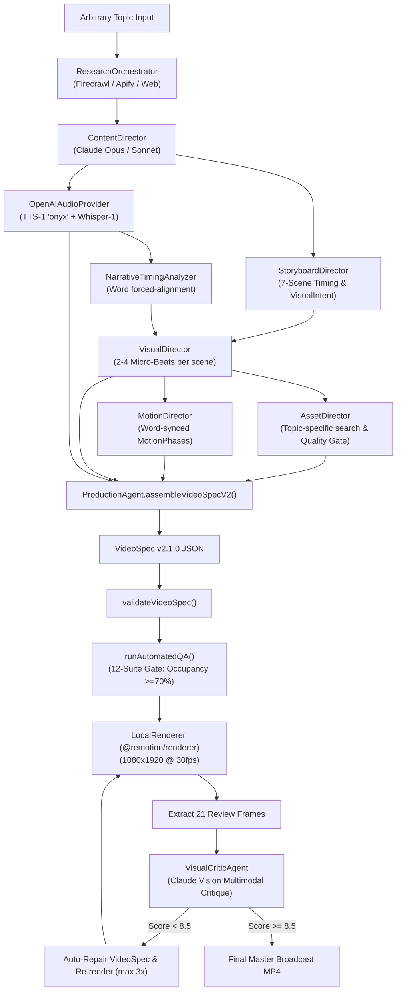

# PHASE 7 GENERIC ENGINE MAP: RUNTIME ARCHITECTURE & PIPELINE FLOW

> **System Topology & Data Flow Document**  
> **Repository:** `Ritish017/Remotion`  
> **Engine Version:** Catalyst Content OS v2.1.0 (Phase 7 Generic Broadcast Engine)

---

## 1. End-to-End Execution Topology



---

## 2. 7-Plane 2.5D LayerStack Architecture

Every visual beat in the generic pipeline decomposes into 7 independent spatial depth planes:

```
┌─────────────────────────────────────────────────────────────────────────────┐
│                          7-PLANE SPATIAL COMPOSITION                        │
├───────┬──────────────────┬───────────┬──────────────────────────────────────┤
│ Layer │ Name             │ Depth Px  │ Component Role                       │
├───────┼──────────────────┼───────────┼──────────────────────────────────────┤
│ 0     │ `background`     │ 0.15      │ Full-frame photographic plate (135%) │
│ 1     │ `backgroundMid`  │ 0.35      │ Architectural blueprint grid & glow  │
│ 2     │ `midground`      │ 0.60      │ Secondary circuit traces & data arcs │
│ 3     │ `subject`        │ 1.00      │ Monolith / 3D Die / Skewed Towers    │
│ 4     │ `foreground`     │ 1.35      │ Laser scan sweep bar & target rings  │
│ 5     │ `typography`     │ 1.50      │ Brutalist display headline (72-140px)│
│ 6     │ `editorialMarks` │ 1.65      │ Declassified stamp & source tag      │
└───────┴──────────────────┴───────────┴──────────────────────────────────────┘
```

---

## 3. Visual Language Component Registry (`src/remotion/visuals/`)

| Visual Language | Primary Physical Primitive | Canvas Occupancy | Typography Treatment |
|---|---|---|---|
| `cinematic-photo` | `CinematicImage` (135% Scale Ken Burns crop) | 85%–95% | $84\text{px}$ `Arial Black` headline + $36\text{px}$ serif subhead |
| `data-story` | `SkewedMonolithTowers` + $280\text{px}$ Counter | 80%–90% | $280\text{px}$ percentage + $76\text{px}$ brutalist headline |
| `technical-diagram`| `PerspectiveDie3D` + `LaserScanBar` | 85%–90% | $145\text{px}$ monolith readout + $76\text{px}$ top header |
| `editorial-paper` | `EditorialCollage` (Archival spreads & stamps) | 75%–85% | $76\text{px}$ display header + $64\text{px}$ metric callouts |
| `geographic-story` | `MapStory` + `CorridorFlightArcs` | 85%–95% | $76\text{px}$ display header + pulsing planetary node tags |
| `cinematic-statistic`| `RadiatingPerspectiveRays` + $320\text{px}$ Hero Metric | 80%–90% | $320\text{px}$ `Arial Black` metric + $56\text{px}$ payoff |

---

## 4. Closed-Loop Visual Critic Controller

```
[Extracted 21 Review Frames]
       │
       ▼
[VisualCriticAgent.critiqueFrames()]
       │
       ├── Canvas Occupancy Score (0-10)
       ├── Anti-Dashboard Verification (0-10)
       ├── Typography Brutalist Scale (0-10)
       ├── Subtitle Collision Check (0-10)
       └── Visual Metaphor Physicality (0-10)
       │
       ▼
Any Critical Issues?
  ├── YES ──► Generate structured correctionPatch:
  │           { scaleMultiplier: 1.15, occupancyPct: 85, typographyScale: 'display_giant' }
  │           ──► visualCriticAgent.applyCorrections(spec, report)
  │           ──► Trigger Next Refinement Render
  │
  └── NO  ──► Mark Video as PRODUCTION_READY (Broadcast Quality Confirmed)
```
