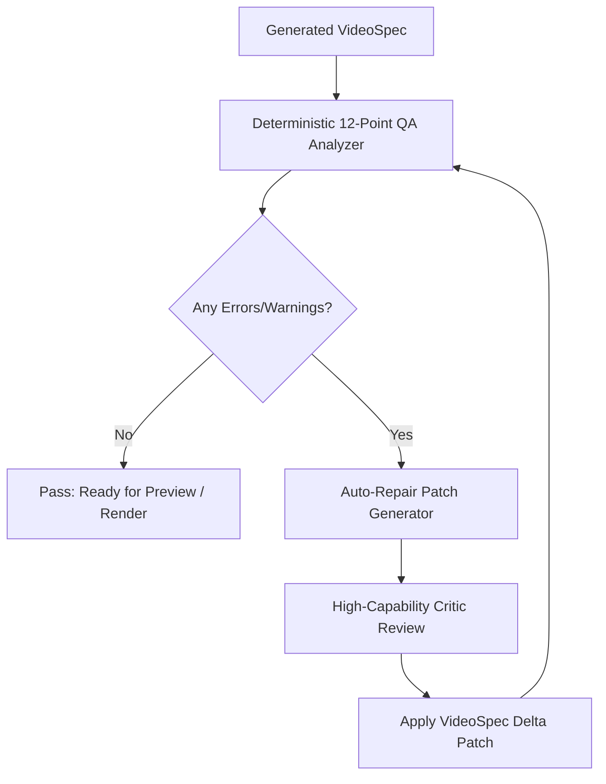

# Automated Video QA & Auto-Repair Engine

> **System:** Catalyst Automated Quality Assurance & Semantic Critic  
> **Inspection Standard:** Broadcast-Grade Safe Zones, Contrast, Motion Rhythm & Narration Sync  
> **Resolution Mechanism:** Automated VideoSpec Correction Patch Generator

---

## 1. 12-Point Automated QA Check Matrix

Before rendering or human sign-off, every `VideoSpec` is evaluated by `runAutomatedQA()`:

| # | Inspection Check | Rule / Threshold | Automated Remediation Action |
| :- | :--- | :--- | :--- |
| **1** | **Safe Area Violations** | Text/subjects must reside within 80% inner boundary (`safeZoneRespect: true`). | Clamp position `x`, `y` into safe margins. |
| **2** | **Typography Contrast** | Luminance contrast ratio between text and background $\ge 4.5:1$. | Add dark scrim backdrop or invert text color. |
| **3** | **Text Overlap & Clipping** | Headline length $\le 60$ characters in 9:16 portrait format. | Wrap lines via `ensureMaxCharactersPerLine()`. |
| **4** | **Narration Sync Gaps** | Visual scene duration must match speech segment duration ($\pm 3$ frames). | Re-time scene `durationFrames` to whisper word end. |
| **5** | **Audio Ducking Check** | Music track volume must not exceed `0.10` during active voiceover speech. | Enforce ducking multiplier in `MasterComposition`. |
| **6** | **Motion Deadlock** | No static screen $> 2.5$ seconds without camera drift or typography reveal. | Inject `slow_drift` or `micro-push` into `CameraRig`. |
| **7** | **Visual Novelty Check** | Novelty score against past 5 campaign episodes must exceed `75%`. | Swap visual language or transition presentation. |
| **8** | **3D Asset Loading** | All 3D meshes / WebGL shaders must attach `delayRender()` handles. | Add async completion guards to canvas mount. |
| **9** | **Transition Collision** | Transition duration must not exceed $50\%$ of shortest adjacent scene. | Cap transition duration at $\min(15, \text{duration}/2)$. |
| **10**| **Color Palette Clashing** | Accent colors must be chosen from validated Brand DNA tokens. | Remap rogue hex codes to primary/secondary palette. |
| **11**| **Framerate & Duration** | Composition FPS must equal 30; total duration must equal sum of scenes. | Synchronize `composition.durationInFrames`. |
| **12**| **Editorial Safe Outro** | Outro scene must include channel callout and clear CTA within final 3 seconds. | Append standard `cinematic-outro` beat if omitted. |

---

## 2. AI Semantic Critic & Auto-Repair Pipeline

### Auto-Repair Patch Generator
When issues are detected, `generateAutoRepairPatch(spec, qaReport)` produces a surgical update without regenerating the entire script or losing customized director parameters.
