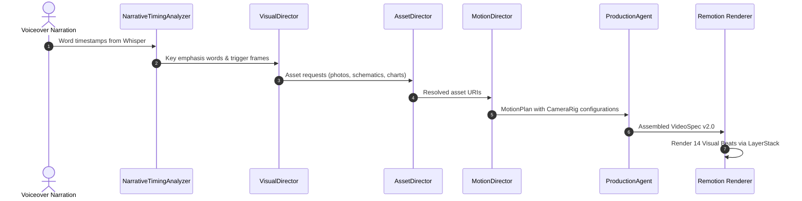

# Visual Director Architecture — Catalyst Content OS (Phase 2)

## 1. Architectural Philosophy: The Director vs. Renderer Split

In Catalyst Content OS, there is an absolute, non-negotiable separation of concerns:

- **Claude is the DIRECTOR**: Formulates structured creative intent (**WHAT**, **WHY**, **WHEN**, **WHERE**, **HOW**). Claude generates structured JSON plans, never raw React JSX/TSX code.
- **Remotion is the RENDERER**: Implements deterministic, performant React/SVG animation primitives. Remotion renders frames with zero hallucination, zero layout shifts, and multi-threaded CPU/GPU acceleration.

```
                  ┌──────────────────────────────────────────────┐
                  │                 USER TOPIC                   │
                  └──────────────────────┬───────────────────────┘
                                         │
                                         ▼
                  ┌──────────────────────────────────────────────┐
                  │          Claude AI Director Pipeline         │
                  │  1. Content Director (Hook + Script)         │
                  │  2. Storyboard Director (Scenes)             │
                  │  3. Narrative Timing Analyzer (Whisper Sync) │
                  │  4. Visual Director (Sub-Scene Micro-Beats)  │
                  │  5. Asset Director (Vector Schematics/Images)│
                  │  6. Motion Director (Camera + Layer Motion)  │
                  └──────────────────────┬───────────────────────┘
                                         │
                                         ▼
                  ┌──────────────────────────────────────────────┐
                  │            VideoSpec v2.0 (JSON)             │
                  │  • VisualBeats (2–5s micro-evolutions)       │
                  │  • Multi-Depth Layer Stacks                  │
                  │  • 14 Camera Rig Movement Descriptors        │
                  │  • Word-Level Whisper Timestamps             │
                  │  • Inlined Data URIs for Audio               │
                  └──────────────────────┬───────────────────────┘
                                         │
                                         ▼
                  ┌──────────────────────────────────────────────┐
                  │         Remotion Local Render Engine         │
                  │  • MasterComposition.tsx                     │
                  │  • VisualBeatRenderer.tsx                    │
                  │  • LayerStack & Multi-Depth Parallax         │
                  │  • 22 Visual Languages Registry              │
                  │  • Multi-Core GPU/CPU Headless Renderer      │
                  └──────────────────────┬───────────────────────┘
                                         │
                                         ▼
                  ┌──────────────────────────────────────────────┐
                  │      Broadcast-Grade Local MP4 Output        │
                  └──────────────────────────────────────────────┘
```

---

## 2. Sub-Scene Micro-Beats Pipeline

Instead of locking a 5–10 second scene into one static visual layout, the **Visual Director** analyzes spoken cadence and decomposes each scene into **2 to 4 micro-beats (2–5 seconds each)**:



---

## 3. The 5-Plane Parallax LayerStack

Every visual beat renders through `LayerStack.tsx` which distributes visual elements across 5 optical depth planes:

```
[Depth 1.50x]  ┌────────────────────────────────────────────────────┐  Typography Layer (Headlines, Karaoke, Callouts)
               │                                                    │
[Depth 1.35x]  ├────────────────────────────────────────────────────┤  Foreground Layer (Annotations, Badges, Stamps)
               │                                                    │
[Depth 1.00x]  ├────────────────────────────────────────────────────┤  Subject Layer (Hardware Chip, Chart, Map, Diagram)
               │                                                    │
[Depth 0.50x]  ├────────────────────────────────────────────────────┤  Midground Layer (Blueprint Grid, Data Wave, Trace)
               │                                                    │
[Depth 0.15x]  └────────────────────────────────────────────────────┘  Background Layer (Gradient, Vignette, Texture)
```

### Depth Multipliers:
- **Background (`0.15x`)**: Subtle drift, provides stability.
- **Midground (`0.50x`)**: Technical grids, circuit traces, radial glow fields.
- **Subject (`1.00x`)**: Primary visual entity (focal point).
- **Foreground (`1.35x`)**: Floating editorial cards, tape graphics, validated stamps.
- **Typography (`1.50x`)**: Kinetic typography, numbers, and word highlights.

---

## 4. 14 Camera Rig Movements

`CameraRig.tsx` provides deterministic camera dynamics powered by Remotion `interpolate` and `spring`:

1. `push`: Dynamic focal zoom into the subject (1.0x -> 1.15x).
2. `pull`: Cinematic reveal pulling outward (1.14x -> 1.02x).
3. `pan-left` / `pan-right`: Horizontal cinematic camera sweep.
4. `pan-up` / `pan-down`: Vertical inspection sweep.
5. `zoom-region`: Targeted zoom toward a specific coordinate `{ x, y }`.
6. `orbit`: Subtle arc rotation around the central anchor.
7. `parallax`: Multi-plane differential translation.
8. `rack-focus`: Focus shift simulating depth-of-field blur change.
9. `handheld`: Procedural organic micro-sway seeded by `motionSeed`.
10. `micro-drift`: Subtle documentary breathing motion.
11. `whip-pan`: High-speed directional motion-blur transition.
12. `snap-zoom`: Instant elastic zoom-in on statistical impact words.
13. `static`: Perfectly locked tripod framing for dense data charts.
14. `match-cut`: Shared geometric continuity across scene transitions.

---

## 5. Local Storage & Zero-Cloud Guarantee

1. **Self-Contained Audio Inlining**: Local voiceover WAV/MP3 files are converted into base64 data URIs before headless rendering, preventing 404 network errors in sandboxed Chromium.
2. **Deterministic Assets**: SVG vector schematics and charts are synthesized directly inside Remotion components, ensuring instant offline execution without external image hosting.
3. **SQLite Persistence**: Render jobs, narration artifacts, and quality reports persist locally in `./storage/catalyst.db`.
