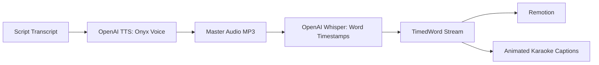

# Catalyst Audio & Word Alignment Architecture

## Overview
Catalyst generates production-grade neural voiceovers using OpenAI's `tts-1` model and aligns word-level karaoke subtitles using OpenAI's `whisper-1` model.

---

## The Audio Pipeline

---

## Frame Synchronization
- Standard Video Frame Rate: **30 FPS**.
- Frame calculation: `startFrame = Math.round(word.startSeconds * 30)`
- Total duration: Video composition length dynamically expands to fit the exact voiceover completion timestamp.

---

## Acoustic Hierarchy & Sound Design
- **Voiceover**: Volume = 1.0 (Master Dialogue Channel).
- **Background Score**: Volume = 0.22 (Low Bed).
- **Automated Ducking**: Background music automatically ducks to 35% of its normal volume during active voiceover sequences.
- **Sound Effects (SFX)**: Pre-timed whooshes, risers, and data surges mapped to scene transition frames.
