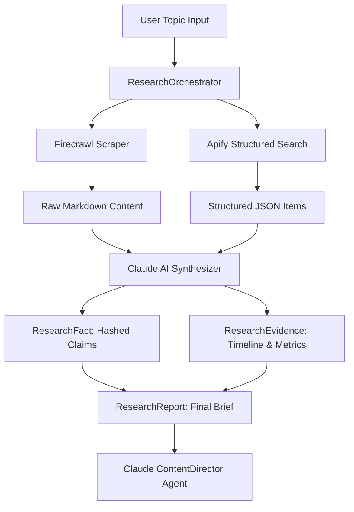

# Catalyst Research Orchestrator & Evidence Architecture

## Overview
The Catalyst Research Engine (`src/lib/research/`) is designed to transform raw web articles into verifiable, high-signal research dossiers used directly by Claude for scriptwriting.

---

## Architecture Flow

---

## Core Models

### 1. `ResearchSource` (`src/lib/research/ResearchSource.ts`)
- Cryptographic SHA-256 ID based on normalized URL.
- Retains publisher, author, date retrieved, and full source content.

### 2. `ResearchFact` (`src/lib/research/ResearchFact.ts`)
- Atomic verified claim (`claim`, `category`, `confidence`, `sourceIds`).
- Enables verifiable provenance where every on-screen number links to a source.

### 3. `ResearchEvidence` (`src/lib/research/ResearchEvidence.ts`)
- Bundles key metrics (`{ label: "Power Reduction", value: "90%" }`) and chronological milestones.

### 4. `ResearchReport` (`src/lib/research/ResearchReport.ts`)
- The unified briefing document containing executive summary, narrative angles, recommended hook, visual direction ideas, and structured evidence.
